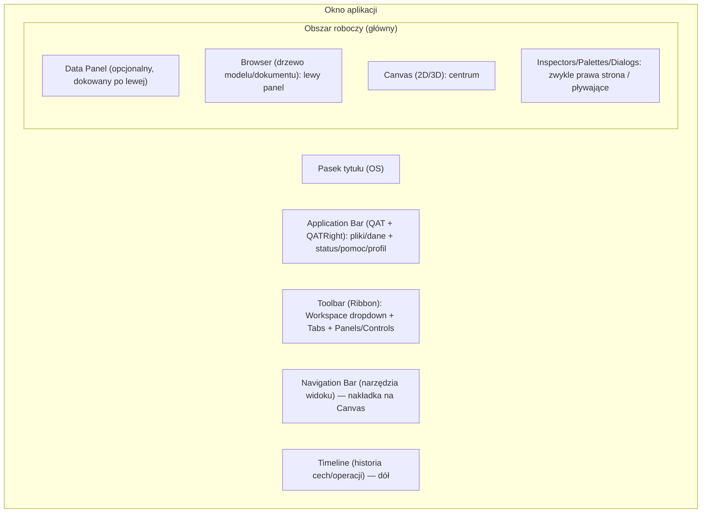

iturn7image1turn6image6turn6image1turn7image5

# Analiza interfejsu wizualnego Autodesk Fusion 360 jako wzorzec do projektowania nowego UI

## Streszczenie wykonawcze

Interfejs Autodesk Fusion 360 (obecnie marka „Autodesk Fusion”) jest konsekwentnie zbudowany wokół stałej siatki elementów: górnego pasa aplikacji (Application Bar / „QAT” po lewej i „QATRight” po prawej), właściwego paska narzędzi typu „ribbon” (Toolbar) z wyborem obszaru roboczego i kartami, lewego drzewa struktury (Browser), centralnego płótna roboczego (Canvas), nakładek nawigacyjnych (ViewCube/Navigation Bar) oraz dolnej osi czasu (Timeline). Autodesk wprost opisuje te obszary jako kluczowe części interfejsu i podkreśla, że narzędzia różnią się zależnie od aktywnego obszaru roboczego i kontekstu (karty kontekstowe i środowiska kontekstowe). citeturn1view0turn1view2turn20view0

Z punktu widzenia projektowania nowego UI inspirowanego Fusion, najbardziej „kopiowalne” (w sensie wzorca, nie grafiki) są: hierarchia Workspaces → Tabs → Panels → Controls; silna kontekstualność (Sketch jako karta kontekstowa, Form jako środowisko kontekstowe, Marking Menu zależne od kontekstu); możliwość personalizacji (pin/unpin, menu pod klawiszem **S**, zmiana skrótów); oraz przewidywalne zachowania responsywne (ukrywanie/pokazywanie elementów, minimalizacja paneli, dokowanie/oddokowanie). citeturn20view0turn17view1turn16search3turn10search11

## Metodologia i uwagi o precyzji

Opis oparto przede wszystkim o oficjalną dokumentację Autodesk (Help/Knowledge Network), oficjalne materiały szkoleniowe Autodesk oraz dokumentację Fusion API, która formalizuje strukturę UI (identyfikatory pasków narzędzi, pojęcia Workspaces/Tabs/Panels, rozmiary ikon, zasady tooltipów). citeturn1view2turn20view0turn21view0turn15view1

Kolory w formacie HEX podaję w dwóch kategoriach: **(a)** „wartości udokumentowane” (gdy Autodesk mówi o motywach/UI Themes), oraz **(b)** „wartości oszacowane” przez próbkowanie pikseli z oficjalnych zrzutów ekranu Autodesk: mapy interfejsu (Light/Classic‑like) i zrzutu „Dark Blue theme” z wpisu blogowego Autodesk. Te wartości należy traktować jako **orientacyjne** (zmieniają się wraz z motywem, DPI, ustawieniami środowiska/tła Canvas, a także drobnymi aktualizacjami UI). citeturn3view0turn14view0turn10search0turn11view0

W raporcie używam nomenklatury współczesnej (Design/Solid/Surface/Form/Manufacture), ale mapuję ją na starsze nazwy wymagane w pytaniu: **Model ≈ Design/Solid**, **Patch ≈ Surface**, **Sculpt ≈ Form**. Autodesk potwierdza zmianę nazewnictwa (np. Patch → Surface) oraz kontekstualny charakter Form. citeturn0search22turn13search1turn13search17

## Układ okna i „szkielet” przestrzeni roboczej

### Stałe strefy okna

Autodesk opisuje pulpitową wersję Fusion jako zestaw stałych obszarów: **Data Panel**, **Application Bar**, **Toolbar**, **Browser**, **Canvas**, **ViewCube**, **Marking Menu**, **Navigation Bar** i **Timeline**. citeturn1view0turn1view2

W praktyce oznacza to układ „top‑heavy + canvas‑centric”:

Górna część okna ma dwa poziomy kontroli:

- **Application Bar** (pas „aplikacyjny”): przyciski związane z plikiem/danymi i stanem aplikacji (zapisywanie, cofnij/ponów, stan zadań, powiadomienia, pomoc, profil). Dokumentacja PL precyzuje elementy w kolejności „od lewej do prawej”, w tym m.in. Save, Undo/Redo, otwarte karty projektu, Extensions, Job Status, Notification Center, Help i My Profile. citeturn1view0turn18search16turn18search1  
- **Toolbar („ribbon”)**: zaczyna się od rozwijanego wyboru **Workspace** i dalej jest podzielony na **Tabs** (karty) oraz „grupy” poleceń. Autodesk wprost mówi, że narzędzia na Toolbar zależą od obszaru roboczego oraz że istnieją karty/środowiska kontekstowe (np. Sketch, Form). citeturn1view0turn20view0

Środek okna jest zdominowany przez **Canvas**; elementy nawigacji widoku są nakładkami lub stałymi kontrolkami: **ViewCube** zwykle w prawym górnym rogu, **Navigation Bar** zwykle w dolnej części Canvas. citeturn1view0turn5search21

Dół okna zajmuje **Timeline** (oś czasu cech/operacji w trybie parametrycznym). Autodesk wiąże ją bezpośrednio z historią projektu i edycją kolejności obliczeń. citeturn1view0turn16search8turn16search0

### Typowe proporcje i wymiary względne

Na oficjalnym zrzucie „UI overview” (1920×1002 px) strefy mają orientacyjnie następujące wysokości:

- górny „chrome” (pasek tytułu/OS): ~35 px (~3,5% wysokości okna),
- Application Bar: ~36 px (~3,6%),
- Toolbar/ribbon: ~100 px (~10%),
- główny obszar pracy (panele + Canvas): ~747 px (~74,6%),
- Timeline: ~61 px (~6,1%). citeturn3view0

Szerokości paneli z tego samego zrzutu (Data Panel otwarty):

- **Data Panel** (lewa nakładka/projekt): ~494 px (~26% szerokości okna),
- **Browser** (drzewo): ~377 px (~20%),
- **Canvas** (w wariancie z otwartym prawym panelem kontekstowym): ~630 px (~33%),
- prawy panel kontekstowy (tu: overflow Marking Menu): ~331 px (~17%). citeturn3view0

W projektowaniu UI warto traktować te liczby jako „**typowy budżet przestrzeni**”, a nie stałe; Autodesk dopuszcza minimalizację/ukrywanie elementów, a panele są dokowalne/oddokowywalne. citeturn16search3turn10search11

### Diagram układu jako mermaid

Poniższy schemat pokazuje logiczny layout (nie piksel‑perfect), który można wzorować w nowym UI:

## Top Bar i system narzędzi: Workspaces, Tabs, Panels, kontekst

### Trzy „zawsze widoczne” paski narzędzi i ich znaczenie projektowe

Dokumentacja Fusion API formalizuje trzy stale wyświetlane toolbary (niezależne od kontekstu) oraz podaje ich znaczenie i identyfikatory:

- **QAT** (górny lewy): szybki dostęp do poleceń „plikowych”; ID = `QAT`,
- **QATRight** (górny prawy): konto użytkownika / help i powiązane; ID = `QATRight`,
- **NavToolbar** (dolny środek): polecenia nawigacji widoku; ID = `NavToolbar`. citeturn20view0turn18search2

To bardzo użyteczny wzorzec przy projektowaniu nowego UI: rozdziela „**stan aplikacji**” (zapis, zadania, powiadomienia, konto) od „**narzędzi domenowych**” (modelowanie, CAM/CAE) i od „**nawigacji widoku**”.

### Ribbon: wybór Workspace i podział na Tabs → Panels → Controls

Fusion ma silnie znormalizowaną hierarchię: **Workspaces** są najwyższym właścicielem struktury UI, a użytkownik wybiera aktywny workspace w dużym rozwijanym menu w górnej części okna; po zmianie workspace „całe UI morphuje” do odpowiedniego zestawu narzędzi. citeturn20view0turn1view0

Wewnątrz workspace występuje:

- **Toolbar Tabs**: organizują komendy w logiczne grupy; przykładowo w Design workspace Autodesk wymienia SOLID, SURFACE, MESH, SHEET METAL (i inne). citeturn20view0turn1view2  
- **Toolbar Panels**: w obrębie karty grupują komendy w „panele”; panel ma część widoczną oraz część w dropdown. Autodesk opisuje, że panel pokazuje podzbiór poleceń z dropdown i że użytkownik może decydować, które polecenia są przypięte („Pin to Toolbar”). citeturn20view0turn18search13

W praktyce wizualnej (Light Gray / Classic‑like): panele są oddzielone pionowymi separatorami, w panelach dominują **duże ikony** (zwykle 32×32 px) z etykietą grupy (np. CREATE/MODIFY/ASSEMBLE), a w dropdownach dominują mniejsze ikony (16×16 px) i listy tekstowe. To wynika wprost z wytycznych ikon w API. citeturn22view0turn20view0

### Ikony: rozmiary, styl, metafory i uproszczenia

Fusion API precyzuje, że standardowe ikony UI są konceptualnie projektowane jako **16×16** (małe) i **32×32** (duże). Małe ikony są używane w toolbarach i dropdownach, a duże w panelach; wytyczne wskazują, że w 16×16 usuwa się nadmiar detali („minimalizacja szumu”), przy zachowaniu stałej grubości linii (przykładowo ramka okna 1 px w obu rozmiarach). citeturn22view0turn20view0

Projektowo oznacza to, że Fusion miesza dwie estetyki, ale w spójny sposób:

- **ikony „narzędzi geometrycznych”**: często izometryczne bryły/powierzchnie z lekkim cieniowaniem (metafora „modelu”), co pomaga rozróżniać operacje typu Extrude/Fillet/Shell,
- **ikony „operacji i narzędzi systemowych”**: bardziej piktogramowe (np. koło zębate/klucz/linijka), częściej płaskie i o prostszym rysunku, dobrze działające w 16×16.

Ważna konsekwencja dla nowego UI: jeśli planujesz inspirować się Fusion, warto zachować **dwupoziomowy system ikon** (duże, bogatsze + małe, uproszczone) i ten sam „DNA” linii (stały stroke), zamiast skalować jedną grafikę w dół. citeturn22view0

### Kontekstualność: karty kontekstowe i środowiska kontekstowe

Autodesk rozróżnia:

- **Contextual tab** – np. Sketch: pojawia się obok innych kart, gdy aktywne są narzędzia kontekstowe. citeturn1view0turn8search17  
- **Contextual environment** – np. Form: pojawia się jako środowisko kontekstowe, a jego karty zastępują domyślne karty do czasu wyjścia z tego środowiska. citeturn1view0turn13search1

W projektowaniu UI to kluczowy wzorzec: „**tryb**” jest komunikowany nie tylko przez zmianę dostępnych narzędzi, ale też przez **morfologię paska** (inne zakładki) i często przez **wyróżnienie akcji zakończenia trybu** (Finish Sketch / Finish Form). Przykładowy materiał „Quick Guide to the new toolbar UI” (PDF) opisuje, że Sketch tab oraz przycisk Finish Sketch są wizualnie wyróżnione (na niebiesko), aby jasno oznaczyć tymczasowy tryb. citeturn13search6

### Marking Menu: kontekstowe menu radialne i gesty

Fusion posiada kontekstowe menu radialne (Marking Menu) wywoływane prawym przyciskiem myszy; Autodesk opisuje je jako podzielone na **pierwszy poziom radialny**, **drugi poziom radialny** i **menu kontekstowe**. citeturn15view1turn1view0

Najważniejsze cechy projektowe:

- zawartość Marking Menu **zmienia się zależnie od** workspace, toolbar tab, środowiska kontekstowego i aktywnej komendy; Autodesk podaje przykłady: w Surface tab „Hole” może być zastąpione przez „Patch”, w Sheet Metal pojawia się „Flange”, a w Form środowisku pojawiają się komendy specyficzne dla T‑Spline. citeturn15view1  
- menu wspiera **gesty** (wybór komend bez pełnego wyświetlania menu); Autodesk opisuje mechanikę: przeciągnięcie kursora w stronę komendy i klik w wyróżniony „klin”, a zamknięcie m.in. przez `Esc`. citeturn15view1  
- dolne menu kontekstowe zawiera m.in. kontrolki nawigacji (Pan/Zoom/Orbit), Isolate/Unisolate, listę workspace oraz „Saved Shortcut keys” – wprost łączy UI kontekstowe ze skrótami klawiaturowymi. citeturn15view1

Wzorzec do kopiowania: radialne menu daje szybki dostęp w Canvas bez „podróży” kursorem do Ribbon, a jednocześnie zachowuje spójność z hierarchią narzędzi (zmienia się wraz z kontekstem).

## Panele boczne, inspektory i zachowania responsywne

### Data Panel: lewy panel danych/projektów

Data Panel to lewy panel do dostępu do hubów/projektów/pliki, z trybami „Data” i „People”; Autodesk opisuje możliwość pokazania/ukrycia, a także skróty: **Ctrl+Alt+P (Windows)** i **Option+Command+P (macOS)**. citeturn19search1turn18search0turn18search30

W kontekście UI design:

- Data Panel jest „meta‑nawigacją” (organizacja zasobów), więc sensownie jest go separować wizualnie (inne tło, osobny nagłówek) i pozwalać całkowicie chować, gdy użytkownik pracuje na Canvas. Autodesk wprost traktuje go jako osobną strefę UI. citeturn1view2turn18search0

### Browser: lewy „design tree” i kontrola widoczności

Browser jest zdefiniowany jako drzewo elementów projektu (komponenty, bryły, szkice, początki, połączenia, geometria konstrukcyjna itd.) i umożliwia kontrolę widoczności. citeturn1view0turn16search14  
W Drawing workspace Browser ma inną semantykę (arkusze, ustawienia dokumentu/arkusza, szkice rysunkowe, referencje), co Autodesk opisuje w dedykowanym „Browser overview (Drawing workspace)”. citeturn4search3turn7image5

Wzorzec do przeniesienia: Browser jest „źródłem prawdy” o strukturze i stanie obiektów (widoczność, suppress/unsuppress, wersje). W nowym UI warto utrzymać:

- spójną ikonografię węzłów (foldery, oka/żarówki, rozwijanie trójkątem),
- kontekstowe menu na węzłach (prawy klik) jako uzupełnienie Ribbon.

### Command dialogs i „palety” (np. Sketch Palette): prawa strona i/lub w Canvas

W Fusion wiele poleceń otwiera dialog do ustawień (parametry, opcje). Autodesk (w materiałach szkoleniowych) wskazuje, że po kliknięciu wielu poleceń „otwiera się dialog” i jako przykład wymienia Sketch Palette. citeturn8search27

**Sketch Palette** ma formalną dokumentację: pojawia się w Canvas przy tworzeniu/edycji szkicu i zawiera często używane opcje; ma też sekcję „Contextual Options” zależną od aktywnego narzędzia lub zaznaczenia. citeturn18search21turn8search17

Projektowo istotne są zachowania „miejsca” i redukcji obciążenia:

- Autodesk zaleca/umożliwia minimalizację dialogów i paneli: command dialogs, Browser i Sketch Palette można minimalizować (w zależności od tego, czy panel jest zadokowany czy pływający, używa się ikony podwójnej strzałki lub minusa). citeturn16search3turn10search2  
- dialogi mogą być dokowane/oddokowywane; Autodesk opisuje, że aby zadokować, przeciąga się dialog do krawędzi i czeka na pionową zieloną linię (wskaźnik dokowania). citeturn10search11turn10search22  
- okna dialogowe (szczególnie CAM) bywają długie i wymagają skalowania; Autodesk opisuje przypadek, w którym okno dialogowe jest „zbyt wąskie” i można je poszerzyć przez przeciągnięcie uchwytu w rogu (dla dialogu oddokowanego). citeturn10search25

### Tooltips i prezentacja skrótów

Dokumentacja API precyzuje zachowanie tooltipów: tooltip bazowy jest zawsze pokazywany, a jeśli dodano „tooltip description” lub „tool clip”, tooltip progresywnie pokazuje więcej informacji wraz z czasem najechania; szerokość tooltipów jest ograniczona do **300 px** i mają zawijanie linii. citeturn21view0

To duży, często pomijany detal do skopiowania: tooltipy w Fusion są projektowane jako „warstwowe” – szybka etykieta → dłuższy opis → (opcjonalnie) clip/sekcja pomocnicza.

W samym UI skróty są komunikowane również przez:

- oficjalną „Shortcut Keyboard Guide” (oddzielne zestawy dla Windows i macOS) oraz wersję PL w dokumentacji; to potwierdza, że Autodesk traktuje różnice OS jako pierwszy‑klasowy element UX. citeturn17view0turn18search18  
- Marking Menu, które w dolnej części ma listę „Saved Shortcut keys”. citeturn15view1  
- menu pod **S** (Toolbox/Shortcut dialog): Autodesk publikuje „Quick Tip: S‑key” i tutorial „Use the Fusion Toolbox”, a polski poradnik wyjaśnia, że S otwiera menu Shortcut z wyszukiwaniem i możliwością przypinania („Pin to shortcut”). citeturn9search19turn9search25turn17view1

### Status, powiadomienia, praca offline

Application Bar ma wyraźnie wydzielone elementy statusowe: **Job Status** i **Notification Center**. citeturn1view2turn18search16  
Autodesk dodatkowo opisuje, że tryb offline jest sygnalizowany czerwonym punktem na ikonie Job Status w prawym górnym rogu Application Bar. citeturn18search1

To jest dobry wzorzec: status systemu (online/offline, zadania w tle) jest w stałym miejscu niezależnym od workspace.

## Zmiany interfejsu w trybach: Model, Patch, Sculpt, CAM, Simulation, Drawing

### Model jako Design i wpływ na układ kart

Autodesk wskazuje, że „Model workspace” został zastąpiony/zmieniony w nowszym UI (w praktyce: Design jako nadrzędny workspace), a w Toolbar występują dziś karty odpowiadające typom pracy (Solid/Surface/Mesh/Form/Sheet Metal itd.). W Fusion API to także przykład organizacji: SOLID/SURFACE/MESH/SHEET METAL jako osobne toolbar tabs w Design workspace. citeturn0search2turn20view0turn1view2

Wzorzec: „Model” nie jest jedną monolityczną kartą – jest to zestaw zakładek o różnych „dialektach” operacji (solid vs surface vs mesh), ale wszystkie działają na tym samym Canvas i zwykle współdzielą Browser/Timeline.

### Patch jako Surface: mapowanie starej nazwy na nowy model UI

Autodesk wprost komunikuje, że Patch workspace został przemianowany – narzędzia „Patch” są w praktyce w obszarze Surface (zależnie od wersji UI). citeturn0search22turn15view1

Ciekawy detal z dokumentacji Marking Menu: Autodesk podaje przykład, że po przełączeniu na Surface tab, komenda „Hole” w Marking Menu może być zastąpiona przez „Patch”. citeturn15view1  
To oznacza, że nawet jeśli użytkownik nie „widzi” Patch jako workspace, system nadal zachowuje koncept patchowania jako kontekstowy zestaw poleceń.

### Sculpt jako Form: środowisko kontekstowe i ograniczenia trybu modelowania

Autodesk opisuje, że **Create Form** wprowadza użytkownika do **Form contextual environment**, a w Timeline dodawana jest cecha Form; wyjście następuje przez **Finish Form**. citeturn13search1turn13search17

Jednocześnie Autodesk Support wskazuje, że Sculpt/Form bywa „niewidoczne” w workspace dropdown, ponieważ (w zależności od konfiguracji) jest dostępne w powiązaniu z trybem modelowania bez historii (direct). citeturn13search0turn16search8

Implikacje UI (dla projektu inspirowanego Fusion):

- wejście w Sculpt/Form powinno jednoznacznie sygnalizować zmianę „języka narzędzi” (inny zestaw zakładek i ikon, często inna kolorystyka akcentów w ikonach),
- powinien istnieć stały, wysoce widoczny „wyłącznik trybu” (Finish Form) – Autodesk konsekwentnie używa schematu „Finish …” jako powrotu do głównego workflow. citeturn13search1turn13search9

### CAM jako Manufacture: inne karty, inne zachowania nawigacji i symulacji

W Manufacture workspace wyspecjalizowane są:

- Ribbon i jego zakładki (np. operacje frezowania/obróbki),  
- Browser (zamiast cech modelu dominuje struktura Setup/Operations/Toolpaths),  
- mechanizmy symulacji ścieżek.

Autodesk opisuje np. że „On the Manufacture workspace toolbar” można uruchamiać postprocessing przez Actions > Post Process. citeturn4search26  
Dla symulacji ścieżek narzędzia Autodesk wskazuje, że używa się opcji w toolbarze i dialogu do sterowania widocznością narzędzia/maszyny/ścieżek i że istnieją player controls oraz timeline symulacji. citeturn4search17

Dodatkowo, w Manufacture modyfikuje się sam Navigation Bar: Autodesk opisuje, że po wejściu do Manufacture Navigation Bar pokazuje opcje „show/hide tool” i „snap tool to cursor”. citeturn16search30turn5search18

Marking Menu również jest „odchudzone” w Manufacture: Autodesk pisze, że Manufacture workspace jest ograniczony w radialnej części (Repeat/Undo/Redo/Import) i opiera się na bogatszym menu kontekstowym do zarządzania toolpathami. citeturn15view1

### Simulation: Setup‑first i zmienność narzędzi zależna od typu badania

Autodesk opisuje workflow: wszystkie polecenia do przygotowania i uruchomienia badania są na **Setup tab** w Simulation toolbar, a same komendy na toolbarze zmieniają się zależnie od typu badania; przy pierwszym wejściu do Simulation pojawia się okno „New Study”. citeturn4search18turn4search25

To bardzo czytelny wzorzec informacyjny: Simulation ma wyraźnie „proceduralny” UI (prowadzenie użytkownika po krokach), który różni się od „narzędziowego” UI w Design.

### Drawing: inny Browser, inne skróty, kontekstowe szkice i szablony

W Drawing workspace Browser ma strukturę związaną z arkuszami, ustawieniami dokumentu i referencjami modelu. Autodesk szczegółowo opisuje węzły (Drawing, Document Settings, Current Sheet, Sheet Settings, Sketches i referencje) w „Browser overview (Drawing workspace)”. citeturn4search3turn7image5

W Drawing istnieją także środowiska kontekstowe (Sketch i Template) do szkiców rysunkowych oraz szablonów. citeturn8search1turn8search24

W zakresie skrótów: Autodesk publikuje dedykowane skróty Drawing (np. Projected View = P, Dimension = D), osobno dla Windows i macOS, także w polskiej wersji dokumentacji. citeturn17view0

## Tabela porównawcza kluczowych elementów UI

W poniższej tabeli „Kolor (HEX)” podaje **dominujące tła** (oszacowane przez próbkowanie oficjalnych zrzutów) osobno dla motywów Light Gray/Classic‑like i Dark Blue. „Styl ikon” i „Stany” są syntezą dokumentacji API, opisu Marking Menu oraz obserwowalnych wzorców UI (disabled/active). citeturn3view0turn14view0turn22view0turn15view1turn21view0

| Element UI | Lokalizacja | Kolor (HEX) | Styl ikon | Zmiany stanu (hover/active/disabled) | Uwagi projektowe |
|---|---|---:|---|---|---|
| Pasek tytułu (chrome OS) | Najwyżej | Light: `#FFFFFF` / Dark: (zależne od OS) | Ikony systemowe OS | Zależne od OS | Windows ma przyciski po prawej; macOS po lewej (traffic lights). |
| Application Bar (QAT + QATRight) | Góra, pod title bar | Light: `#F0F0F0` / Dark: ~`#374150` | Małe ikony (często 16×16) | Disabled: szarość; statusowe badge (np. offline) | Zawiera m.in. Save, Undo/Redo, Job Status, Notification Center, Help. citeturn1view2turn18search1 |
| Workspace dropdown | Lewa część Toolbara | Light: `#F0F0F0` / Dark: ~`#374150` | Ikona + tekst, caret ▼ | Active: zmiana podświetlenia pola | Zmiana workspace przebudowuje UI („UI morphs”). citeturn20view0 |
| Tabs (SOLID/SURFACE/…) | Górny rząd Toolbara | Light: `#F0F0F0` / Dark: ~`#374150` | Tekst + drobne ikony | Active tab: podkreślenie/kolor akcentu; contextual tabs pojawiają się/nikną | Sketch jako contextual tab; Form jako contextual environment zastępujący zakładki. citeturn1view0turn8search17turn13search1 |
| Toolbar Panels (CREATE/MODIFY/…) | Toolbara, pod Tabs | Light: `#F0F0F0` / Dark: ~`#374150` | Duże ikony 32×32 + etykiety panelu | Hover: tło przycisku; Active: stan wciśnięty; Disabled: wyszarzenie | Panel + dropdown; pin/unpin komend (Pin to Toolbar). citeturn20view0turn18search13 |
| Data Panel | Lewa krawędź (dokowany), opcjonalny | Light: ~`#E6E6E6` / Dark: zależne od motywu | Mini‑ikony list i kafli | Show/Hide; może być ukryty | Skrót: Ctrl+Alt+P (Win) / Option+Command+P (Mac). citeturn19search1 |
| Browser (Design tree) | Lewy panel obszaru roboczego | Light: `#FFFFFF` / Dark: ~`#465564` | Małe ikony 16×16 (foldery, oko/visibility) | Węzły expand/collapse; stany widoczności | Zawartość Browser zmienia się między workspaces (np. Drawing). citeturn1view0turn4search3 |
| Canvas | Centrum | Light: `#FFFFFF` / Dark: ~`#465564` | Brak ikon — grafika modelu + manipulatory | Wiele nakładek kontekstowych | Tło Canvas może się zmieniać przez Display Settings/Environment. citeturn5search3turn10search23 |
| ViewCube | Prawy górny róg Canvas | Light: (jasne) / Dark: (ciemniejsze) | 3D‑kostka, typowo półrealistyczna | Hover: podświetlenia ścian/osi | Można ukryć/pokazać (File > View > Show View Cube). citeturn19search2turn1view0 |
| Navigation Bar (NavToolbar) | Dół Canvas, zwykle środek | Light: ~`#F0F0F0` / Dark: ~`#414B5A` | Małe ikony (orbit/pan/zoom) | Hover: highlight; tryby nawigacji aktywne | W Manufacture może dodawać opcje dot. narzędzia (show/hide tool). citeturn16search30turn20view0 |
| Marking Menu (radial + overflow) | Wokół kursora ( + lista) | Light: ~`#F9F9F9` / Dark: ~`#374150` (tło list) | Kliny radialne + lista tekstowa | Klin aktywny wyróżniony; `Esc` zamyka; zawartość zależy od kontekstu | 2 poziomy radialne + context menu z „Saved Shortcut keys”. citeturn15view1 |
| Timeline | Dół okna | Light: `#F0F0F0` / Dark: ~`#374150` | Ikony cech w sekwencji | Hover: tooltip cechy; drag&drop kolejności | Obecna w Parametric Modeling Mode; brak w Direct Modeling Mode. citeturn16search8turn16search0 |
| Sketch Palette | W Canvas (często prawa strona jako paleta) | Light: (biel + szarości) / Dark: (ciemne panele) | Ikony 16×16 + checkboxy | Minimalizacja palety; Finish Sketch kończy tryb | Sketch Palette jest opisana jako dialog w Canvas. citeturn18search21turn8search17 |
| Tooltips | Nad kontrolkami | Tło: jasne/ciemne zależnie od motywu | Tekst, czasem clip | Progresywne rozwijanie; max szer. 300 px | Ograniczenie 300 px to twarda reguła w API. citeturn21view0 |
| Toolbox / menu pod S | Popup przy kursorze | Motyw‑zależne | Siatka ikon + wyszukiwarka | Pin/unpin; wyszukiwanie | Autodesk promuje S‑key jako skrót do spersonalizowanego menu. citeturn9search19turn17view1 |

### Akronim kolorów akcentu (użyteczne przy projektowaniu inspirowanym)

Na podstawie próbkowania oficjalnych screenshotów Autodesk:

- Light Gray/Classic‑like: dominujący akcent UI (niebieski/cyjan) ≈ `#0696D7` (stosowany m.in. do wyróżnień/aktywności), citeturn3view0turn22view0  
- Dark Blue theme: jasny akcent (podświetlenia/selection) ≈ `#6ECDFA`, przy głębokich tłach paneli ~`#374150` i tle Canvas ~`#465564`. citeturn14view0turn11view0

Autodesk oficjalnie wskazuje, że dostępne są co najmniej motywy: **Light gray**, **Dark Blue**, **Fusion classic**, a Fusion może też dopasowywać motyw do systemu („Match OS”). citeturn10search0turn11view0turn22view0